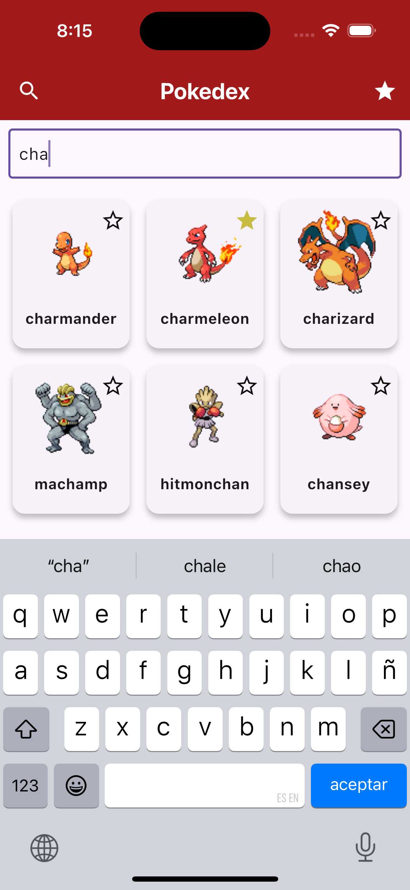

# pokedexapp

A new Flutter project.

## Getting Started

This project is a starting point for a Flutter application.

A few resources to get you started if this is your first Flutter project:

- [Lab: Write your first Flutter app](https://docs.flutter.dev/get-started/codelab)
- [Cookbook: Useful Flutter samples](https://docs.flutter.dev/cookbook)

For help getting started with Flutter development, view the
[online documentation](https://docs.flutter.dev/), which offers tutorials,
samples, guidance on mobile development, and a full API reference.

## How to Use

- **Search Pokémon**: Use the search bar at the top of the screen to search for Pokémon by name.
- **View Pokémon Details**: Tap on any Pokémon from the list to view detailed information about it, such as its type, abilities, height, and weight.
- **Add to Favorites**: Tap the heart icon to mark a Pokémon as a favorite.
- **Clear Search**: Tap the clear button to reset the search.

## Technologies Used

- **Flutter**: Framework used for building the app.
- **Pokémon API**: Used to fetch data about Pokémon.
- **Provider**: For state management.
- **Material Design**: For building a responsive and user-friendly UI.

## Assets

This project uses the following assets:

1. **Pokémon Images**: High-quality images of Pokémon retrieved from the Pokémon API.
2. **Icons**: Custom heart icons used for marking favorites, sourced from Material Design Icons.
3. **App Screenshots**: Screenshots of the app interface, showcasing different screens of the app.

### Included Assets:

- **Pokeball Image**: `assets/pokeball.png`

#### App Screens:

  
  
  
  

## How to Run

1. Clone the repository.
2. Install the dependencies by running `flutter pub get` in the terminal.
3. Run the app on an emulator or a physical device using `flutter run`.

## Why I Used Provider for State Management

Why I Used Provider for State Management

In this app, **Provider** is used for state management because it offers a simple, efficient, and scalable solution for managing the app's state across different screens and components. Provider allows for a clean separation of business logic and UI, ensuring that the app's data and UI are decoupled and that changes in the state are reflected in the UI in a predictable manner.

Specifically, Provider is used to:

1. **Manage Favorites**: The app allows users to add Pokémon to their favorites list. Using Provider ensures that the favorites list is consistently updated across the app, even when navigating between different screens. The state of the favorites list is managed in a dedicated `FavoritesProvider` class, which listens for changes and updates the UI whenever the list is modified.
  
2. **Centralized State**: By using Provider, the state related to favorite Pokémon is stored centrally, making it easier to manage and share across the app. This helps to avoid redundant logic and makes it simpler to maintain the app as it scales.

3. **Efficient UI Updates**: Provider ensures that the UI automatically reflects the state changes without the need for manual intervention. When a Pokémon is added or removed from the favorites, the UI is updated immediately, providing a smooth and responsive user experience.

4. **Decoupling Business Logic**: The use of Provider allows the business logic (such as adding/removing Pokémon from favorites) to be separated from the UI components. This results in a more maintainable codebase and facilitates testing and debugging.

5. **Scalability**: As the app grows, Provider will help manage complex state scenarios more efficiently, making it easier to implement additional features like handling user authentication, fetching data from APIs, and managing other app-wide states.

Overall, Provider is an ideal choice for this app due to its simplicity, flexibility, and strong community support, making it an essential part of the app's architecture for managing state effectively.
