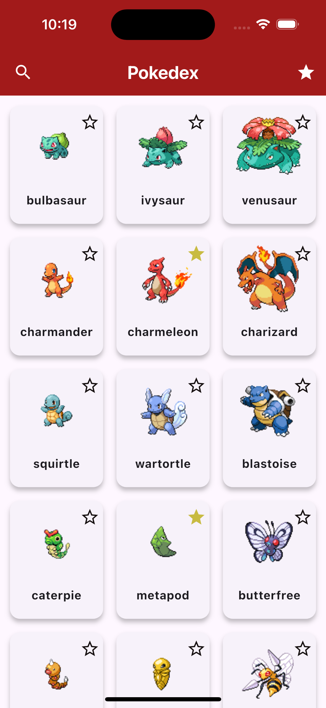
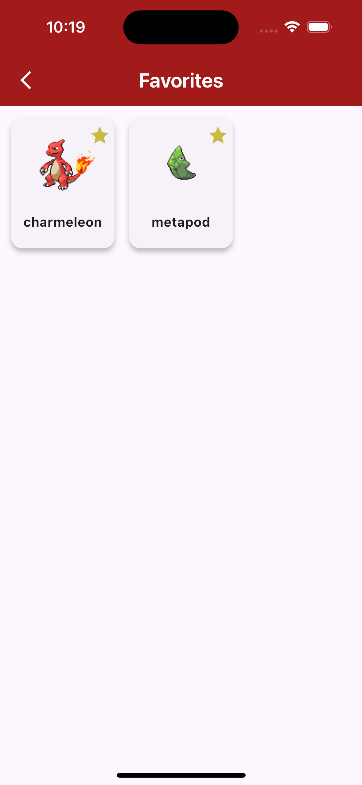
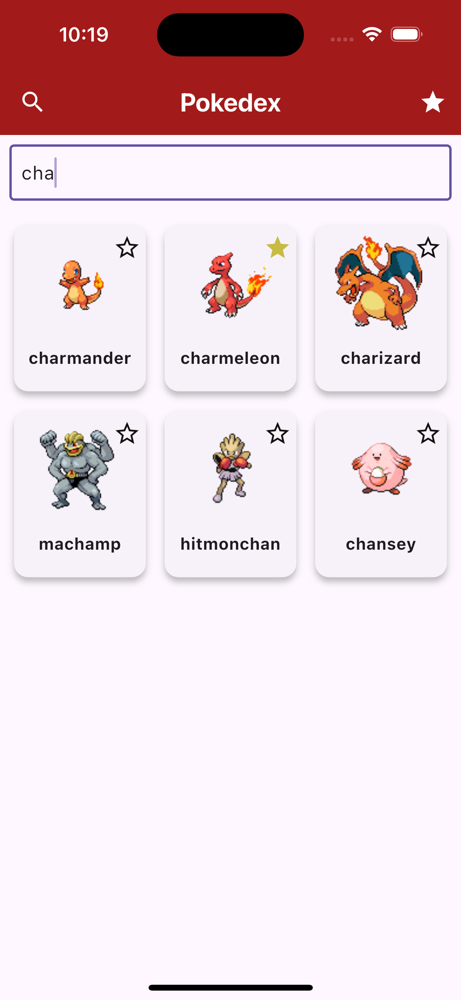
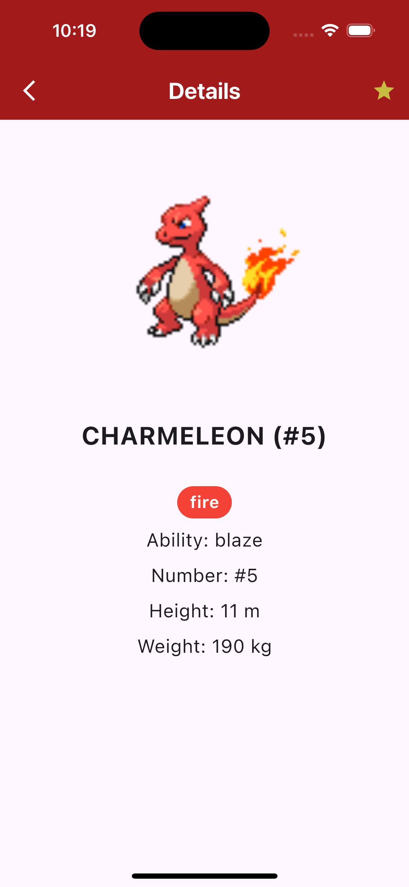

# pokedexapp

A new Flutter project.

## Getting Started

This project is a starting point for a Flutter application.

A few resources to get you started if this is your first Flutter project:

- [Lab: Write your first Flutter app](https://docs.flutter.dev/get-started/codelab)
- [Cookbook: Useful Flutter samples](https://docs.flutter.dev/cookbook)

For help getting started with Flutter development, view the
[online documentation](https://docs.flutter.dev/), which offers tutorials,
samples, guidance on mobile development, and a full API reference.

## How to Use

- **Search Pokémon**: Use the search bar at the top of the screen to search for Pokémon by name.
- **View Pokémon Details**: Tap on any Pokémon from the list to view detailed information about it, such as its type, abilities, height, and weight.
- **Add to Favorites**: Tap the heart icon to mark a Pokémon as a favorite.
- **Clear Search**: Tap the clear button to reset the search.

## Technologies Used

- **Flutter**: Framework used for building the app.
- **Pokémon API**: Used to fetch data about Pokémon.
- **Provider**: For state management.
- **Material Design**: For building a responsive and user-friendly UI.

## Assets

This project uses the following assets:

1. **Pokémon Images**: High-quality images of Pokémon retrieved from the Pokémon API.
2. **Icons**: Custom heart icons used for marking favorites, sourced from Material Design Icons.
3. **App Screenshots**: Screenshots of the app interface, showcasing different screens of the app.

### Included Assets:

- **Pokeball Image**: `assets/pokeball.png`
- **Screen 1**: 
- **Screen 2**: 
- **Screen 3**: 
- **Screen 4**: 

## How to Run

1. Clone the repository.
2. Install the dependencies by running `flutter pub get` in the terminal.
3. Run the app on an emulator or a physical device using `flutter run`.
